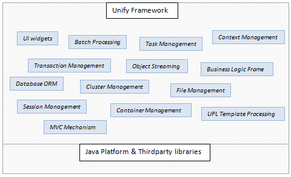

<h1 align="center"></h1>  

Unify Framework is a server-side component-based framework for developing web applications in Java. The entire framework is built on the concept of a pool of configurable components interacting with each other at runtime to provide complete application functionality.

The framework makes available, to the developer, a solid set of reusable and extensible software components built using simple high level abstractions that effectively hide the details of underlying complexities from the developer.

Figure 1: Unify Framework

All components, from UI widgets to business logic and database components, share a common DNA allowing for the same basic simplicity across the framework. 

Components are provided for the full web application stack which makes the need for the mishmash of varying technologies unnecessary.

Figure 2: Architecture

The framework architecture adopts the popular 3-tier architecture for web applications which is composed of three layers of computing – the presentation tier, business logic tier and data tier. The MVC model is used in the presentation tier with view elements based on UPL templates.

* [Unify Container](/tcdng/unify-framework/wiki/Unify-Container)
* [Unify Component](/tcdng/unify-framework/wiki/Unify-Component)
* [Unify Page Language](/tcdng/unify-framework/wiki/Unify-Page-Language)
* [Core Components](/tcdng/unify-framework/wiki/Core-Components)
* [Web Components](/tcdng/unify-framework/wiki/Web-Components)
