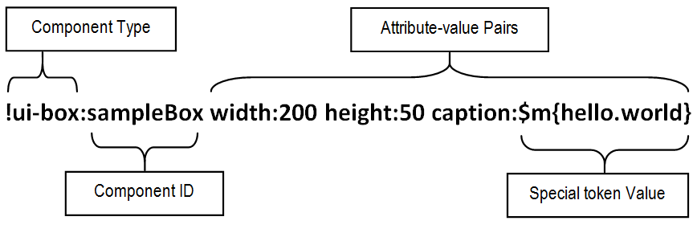

## Overview

Unify Page Language (UPL), a feature of the Unify framework, is a language used for declaring a group of components and specifying the relationship between them. The basic unit of the language is a UPL descriptor which is used to declare a single component and its attribute values. Multiple of these units can be grouped together to define more complex components.



Figure 1: UPL Descriptor Breakdown

A descriptor is a string that begins with the exclamation symbol ‘!’ followed by a component type with optional instance ID (depending on component type) and a set of UPL attribute-value pairs. The component type and ID pair is separated by the ‘:’ symbol. An attribute and value pair is also separated by the same symbol. All pairs are separated by any whitespace symbol. An attribute can have different types of values some of which are specified by special tokens. Special tokens begin with the ‘$’ symbol followed by a reserved character, an opening brace, content string and finally a closing brace.

## UPL Component

A UPL component is a specialized _UnifyComponent_ that can be declared with a UPL descriptor. UPL components must implement the _UplComponent_ interface  and can have a set of one or more attributes, called UPL attributes, that determine the nature of the component. UPL attributes are defined using the _@UplAttributes_ and _@UplAttribute_ annotations. The framework provided a convenient _AbstractUplComponent_ class that you can extend to implement new UPL components.

Listing 1: UPL Component Example

```java
@Component("ui-box")
@UplAttributes({
    @UplAttribute(name = "width", type = int.class),
    @UplAttribute(name = "height", type = int.class),
    @UplAttribute(name = "caption", type = String.class)})
public class Box extends AbstractUplComponent {
    ...
    public String getCaption() throws UnifyException {
        return getUplAttribute(String.class, "caption");
    }

    public int getWidth() throws UnifyException {
        return getUplAttribute(int.class, "width");
    }

    public int getHeight() throws UnifyException {
        return getUplAttribute(int.class, "height");
    }
}
```

Generally, UPL components are non-singletons and each instance composition is based on a specific locale. A UPL component instance can be obtained directly from the _UnifyContainer_ instance or indirectly using the _UnifyComponentContext_ object. Both objects have the _getUplComponent()_ method that allows us to pass the UPL component descriptor of the component we are interested in and its locale. We also set whether the returned instance should be cached for reuse or not.

Listing 2: Get UPL Component Instance Example

```java
Box box = (Box) getUplComponent(getSessionLocale(),
        "!ui-box caption:$s{Mile 2} width:200 height:50", false);
```

## UPL Document

A UPL document is a set of one or more UPL descriptors grouped to define a page. A descriptor can span more than one line in a UPL document. Comments can also be included. A comment begins with double ‘/’ symbol and spans a single line only.


## Special Tokens

| Token | Description |
|-------|-------------|
| $m{...} | A message token. Content string is used as a key to fetch actual message from application resource bundle using application or user session locale. |
| $s{...} | A string token. Content string is used as is. Suitable for specifying strings that have white spaces. |
| $l{...} | A string list token. Content string is one or more words separated by white space. Used for specifying a list of strings. |
| $r{...} | A reference token. Content string is a component reference ID. Used to refer to another component in the same UPL document. |
| $c{...} | A reference list token. Content string is one or more component reference IDs separated by white space. Used to refer to other multiple components in the same UPL document. Always compiled to a com.tcdng.unify.core.upl.UplElementReferences data object. |
| $d{...} | A descriptor token. Content string is a UPL descriptor. Used for declaring an inline UPL component. |
| $f{...} | A foreign value token. Content string is name of value that is set in a foreign UPL document.Allows the value of an attribute of a component descriptor in a UPL document be set, optionally, in another UPL document. |
| $g{...} | A guarded value token. Content string is name of value that is set in a foreign UPL document. Used for enforcing the value of an attribute of a component descriptor in a UPL document is set in another UPL document. |
| $n{...} | A name token. Content string is concatenated with name of component binded to UPL document. |
| $e{...} | An element type token. Content string is concatenated with name of component in UPL descriptor. |
| $t{...} | A theme token. Content string is concatenated with user’s current theme resource path. Used for specifying a resource based on theme. |
| $j{...} | A Java constant token. Content string is the full name of a static string constant. Used for specifying a Java string constant that exists in the application class path. |
| $o{...} | A context scope token. Content string is the name of a resource. Used to indicate resource should be fetched from context scope. |
| $x{...} | A container setting token value. Content string is the name a container setting. Used to indicate value should be fetched from container setting. |
