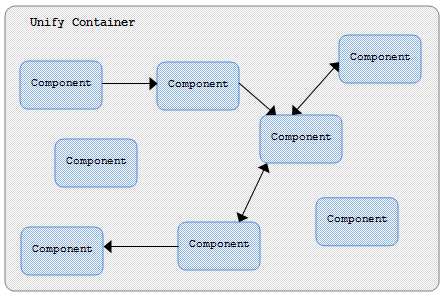

## Overview

The Unify container is a configurable lightweight Java object that provides an environment for Unify components to run. It creates and maintains a pool of component instances that operate together to provide application functionality. It also provides the necessary internal contexts which the components use to interact with one another and with the container itself. Primarily, what the container does is to instantiate components and wire them together. All other functionality that the container provides - like session management, transaction management and cluster management - are made available indirectly by specialized components which themselves are maintained by the container.



Figure 1: Unify Container 

The container manages components as singletons or non-singletons depending on how they are configured. It uses a form lazy component instantiation where components are created and initialized only at the first time they are needed. Single instances of singleton components are created and maintained throughout the lifetime of the container. The container manages the termination of such instances at shutdown. Termination of non-singleton instances created by the container is not managed. Like their singleton counterparts, they go through garbage collection when there is no longer any reference to them.

## Container Startup

To startup a _UnifyContainer_ you create a new instance using its zero-argument constructor, then you invoke its _startup()_ method passing two arguments - a _UnifyContainerEnvironment_ object and a _UnifyContainerConfig_ object.

The _UnifyContainerEnvironment_ object holds a _TypeRepository_ and the container's working path. A _TypeRepository_ contains information on component types that are available to the container; these are types that can be loaded from the JVM's class path. Type repositories can be constructed using the _TypeUtils.getTypeRepositoryFromClasspath()_ or _WebTypeUtils.getTypeRepositoryFromServletContext()_ static methods. The methods scan for type information in the entire JVM class path and/or servlet context paths for classes annotated with the _@Component annotation_. The working path is the system path that contains all folders and files specific to a container. When utilizing default startup from configuration XML, the working folder must contain at least one folder - the 'conf' folder- which in turn must contain the container's configuration file - 'unify.xml'.

```
|-- workingFolder
    |-- conf
        |-- unify.xml
    |-- download
    |-- logs
    |-- web
        |-- images
```

The _UnifyContainerConfig_ object holds application attributes, container properties values and component configurations. This object can be populated manually or by using the framework utility _UnifyConfigUtils_ class which has the _readConfigFromTypeRepository()_  method and variants of _readConfigFromXml()_ methods that can be used to populate the configuration object from a _TypeRepository_ or from an XML configuration _File_, _InputStream_ or _String_. The set of component configurations in a _UnifyContainerConfig_ object determines the type of components that the container can create and how they are managed.

Configuration for a component is represented by the _UnifyComponentConfig_ class with its properties represented by the _UnifyComponentSettings_ class.

The container startup sequence is as follows: 
* The container sets all its internal properties with the values from the configuration object and initializes its internal components. 
* Business logic components that implement the _BusinessService_ interface are detected and proxy classes generated and loaded for them.  
* The application _BootService_ component specified by the configuration 'application.boot.component' property is created, initialized and its _startup()_ method is fired. 
* All components with periodic methods (methods annotated with the _@Periodic_ annotation)  are detected and are setup to run in a periodic schedule.  
* All configured _UnifyContainerInterface_ components are created, initialized and opened to start servicing requests.

### Startup with Manual Configuration

Listing 1: Startup with Manual Configuration

```java
// Set container environment
TypeRepository typeRepository = TypeUtils.getTypeRepositoryFromClasspath();
UnifyContainerEnvironment uce =
    new UnifyContainerEnvironment(typeRepository, "/MyWorkingFolder");

// Set container configuration
UnifyContainerConfig ucc = UnifyContainerConfig.newBuilder()
    .productionMode(true).clusterMode(false)
    .setProperty(UnifyCorePropertyConstants.APPLICATION_NAME, "Booking App!")
    .setProperty(UnifyCorePropertyConstants.APPLICATION_LOG_LEVEL, "DEBUG")
    .setProperty(UnifyCorePropertyConstants.APPLICATION_LOG_TO_CONSOLE, "false")
    .setProperty(UnifyCorePropertyConstants.APPLICATION_LOG_TO_FILE, "true")
    .setProperty(UnifyCorePropertyConstants.APPLICATION_LOG_FILENAME, "bookit.log")
    .setProperty(UnifyCorePropertyConstants.APPLICATION_LOG_FILEMAXSIZE, "100MB")
    .setProperty(UnifyCorePropertyConstants.APPLICATION_LOG_FILEMAXBACKUP, "4")
    .scan(typeRepository)
    .addComponentConfig("booking-service", "Booking Service",
        BookingService.class, true,
        new UnifyComponentSettings(
            new Setting("maxBookingEntries", Integer.valueOf(10)),
            new Setting("applyDiscounts", Boolean.TRUE)))
    .addComponentConfig("loan-service", "Loan Service", LoanService.class, true)
    .build();

// Create and start container
UnifyContainer container = new UnifyContainer();
container.startup(uce, ucc);
```

### Startup with Configuration from XML

Listing 2: Startup with Manual Configuration (XML configuration)

```xml
<?xml version="1.0" encoding="UTF-8"?>
<unify id="instance_0001" production="false" cluster="false"
    version="1.0">
    <!-- Settings -->
    <properties>
        <property name="application.name" value="Booking App!"/>
        <property name="application.logger.level" value="DEBUG"/>
        <property name="application.logger.toconsole" value="false"/>
        <property name="application.logger.tofile" value="true"/>
        <property name="application.logger.filename" value="bookit.log"/>
        <property name="application.logger.filemaxsize" value="100MB"/>
        <property name="application.logger.filemaxbackup" value="4"/>
    </properties>
    
    <!-- COMPONENTS -->
    <components>
        <component name="booking-service"
            class="com.tcdng.unify.samples.BookingService"/>
            <properties>
                <property name="maxBookingEntries" value="10"/>
                <property name="applyDiscounts" value="true"/>
            </properties>
        <component name="loan-service"
            class="com.tcdng.unify.samples.LoanService"/>
    </components>
</unify>
```

Listing 3: Startup with Manual Configuration (Java)

```java
// Set container environment
TypeRepository typeRepository = TypeUtils.getTypeRepositoryFromClasspath();
UnifyContainerEnvironment uce =
    new UnifyContainerEnvironment(typeRepository, "/MyWorkingFolder");

// Set container configuration
File xmlFile = new File(uce.getEnvironmentFilename("conf/unify.xml"));
UnifyContainerConfig ucc = UnifyContainerConfig.newBuilder()
    .readXml(xmlFile)
    .build();

// Create and start container
UnifyContainer container = new UnifyContainer();
container.startup(uce, ucc);
```

## Container Shutdown

A container instance that is started and running can be shutdown in two ways:
1. One by invoking the _shutdown()_ method on the _UnifyContainer_ instance.
2. Sending a "shutdown" command to the container through its command interface. The command interface must be open and servicing requests.

The shutdown sequence is as follows: 
* All interfaces are closed. The _stopServicingRequests()_ method is fired for each _UnifyContainerInterface_ component including the container's command interface component.  
* Cancel commands are sent to all periodic tasks via corresponding task monitors. 
* The _shutdown()_ method is called on the application _BootService_ component.
* Each singleton component instance in the container's component pool is terminated by invoking its _terminate()_ method.


## Container Settings

| Name | Required | Description |
|------|----------|-------------|
| application.code | true | The container application code. All nodes within the same cluster must share the same application code. |
| application.name | true | The container application name. |
| application.banner | false | The application banner text resource. Defaults to 'banner/banner.txt'. |
| application.colorscheme | false | The application color scheme. Can be any string value in {red, blue, green, orange, gray}. |
| application.toconsole | false | Indicates if the container should put information in console. Defaults to 'true'. |
| application.boot.component | false | The container application boot component name. A boot component must implement the _BootService_ interface. If this property is not set in configuration the container uses the default boot component with name  "default-bootservice". |
| application.locale | false | The application locale. Use the format \<language code>\[_\<country code>\[_\<variant code>]]. Defaults to the JVM locale if not set. |
| application.timezone | false | The application time zone ID. The ID in full name, for example 'Africa/Lagos', or custom ID such as 'GMT+1:00'. |
| application.messages.base | false | A list of base names for the property files backing the container's application message resource bundles. |
| application.interfaces |false | A list of the names the container's application interface components. All components in this list must implement the _UnifyContainerInterface_ component interface. |
| application.command.interface.enabled | false | This property determines if the container's command interface is enabled. It is a boolean property and defaults to 'false' |
| application.layout | false | A list of application layout class names. Names should be ordered by preference as the container would search for layout related components, references and templates using this list. |
| application.customization | false | A list of application customization extension names. Names should be ordered by preference as the container would search for customization components using this list. |
| application.logger.pattern | false | The logging pattern to be used by container for logging messages. |
| application.logger.level | false | The container's logging level which can be in {OFF, FATAL, ERROR, WARN, INFO, DEBUG, TRACE, ALL}. |
| application.logger.toconsole | false | A boolean property that indicates if the the container should log messages to the system console or not. Defaults to 'false' |
| application.logger.tofile | false | A boolean property for enabling or disabling the logging of messages to a file by the container. Defaults to 'false' |
| application.logger.filename | false | The file name to log messages to if logging to file is enabled. |
| application.logger.filemaxsize | false | The maximum file size in bytes for a log file if logging to file is enabled. Size suffixes "KB", "MB" and "GB" are allowed. Defaults to '1MB'. |
| application.logger.filemaxbackup | false | The maximum number of backup file to keep if logging to file is enabled. Defaults to 3. |
| application.query.limit | false | The application limit to records fetchable from database if application query limit is enabled. Defaults to 10000. |
| application.session.timeout | false | User session timeout in seconds. Defaults to 600. |
| application.web.home | false | The application home page controller. Defaults to '/home'. |
| application.web.common | false | The application common utilities page controller. Defaults to '/commonutilities'. |
| application.web.theme | false | The application theme relative path. Defaults to '/web/themes/farko'. |
| application.web.stylesheet | false | List of additional application web client style sheets. |
| application.web.script | false | List of additional application web client scripts. |
| application.web.remote.viewing | false | Indicates if application can be viewed remotely. Defaults to 'false'. |
| application.web.remote.viewers | false | A list of the URLs of permitted remote viewers. |
